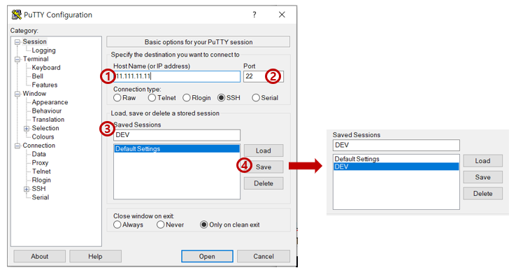

---

layout: post
title:  "PuTTY란?"
date:   2021-04-04T16:10:52-17:00
author: Yunju Choi
categories: 환경구성
tags:	PuTTY linux
cover:  "/assets/heart.png"
---

## PuTTY란?

리눅스 서버에 원격 접속하기 위한 프로그램입니다.

## PuTTY 이용 이유

리눅스에서 리눅스 인스턴스로 접속해서 원격제어를 하는 경우 SSH 방식을 이용합니다.

하지만 Windows 운영체제에서는 SSH를 제공하지 않습니다.

따라서 SSH 역할을 해주는 프로그램인 putty를 이용합니다.

## PuTTY 사용법

#### [서버 접속을 위한 설정 방법]

1. 접속을 원하는 서버의 IP 입력
2. SSH접속을 할 것이기 때문에 Port에는 22 입력
3. 세션 이름을 지정
4. [Save] 버튼 클릭

